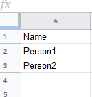
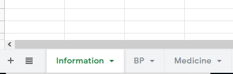
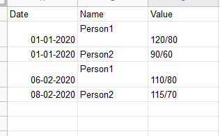
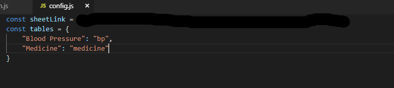

### Home-Med

This uses Google Sheets with [Sheety](https://sheety.co/) as a database.

- Set up a new project in sheety.
- In you spreadsheet, create a sheet named `Information` and fill them in with the name of people you are collecting records of
  
  

- Then create necessary sheets for the type of records.
  
  

- Make sure the records corecctly correspond with the names specified in `Information` sheet.
  
  

- In `config.js` fill in `sheetLink` that you got from Sheety, `tables` with the names that you want to see in the drop down menu as key and sheet name in the spreadsheet(in lowercase)
  
  

- Make sure to **sync everything** in Sheety.
- Open `index.html` in a browser to use or host it on the cloud.